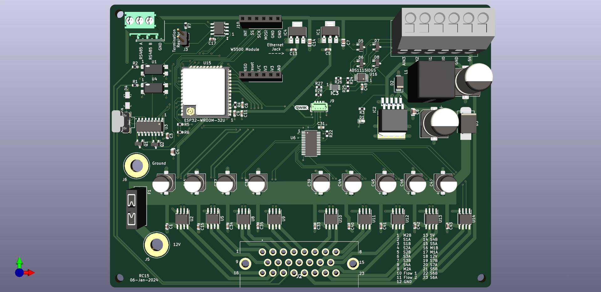

# Note

This project is a work in progress. Progress notes are shared below.

# Hardi-Navigator-AOG-Section-Control

 A PCB that adds AgOpenGPS section and rate control functionality to a Hardi Navigator 3000 trailed sprayer. This PCB replaces a PCB installed on the sprayer from the factory. No cutting of wires is required to install the new PCB and the sprayer can quickly be reverted to factory operation.

 ## The Sprayer

 The sprayer is a Hardi Navigator 3000. I generally pull this sprayer with a John Deere 7410 tractor equipped with an AgOpenGPS guidance system. In the past this tractor was equipped with a Trimble CFX-750 and the Hardi JobCom connection was used for automatic section control. Since upgrading to AgOpenGPS I have been using manual section controls. The intent of this project is to regain automatic section control.

  
 

 The sprayer is equipped with a 90' eagle boom and 6 section valves. The 6 section valves are of the EVC type, utilizing a DC motor to direct flow between the boom and tank return.

 

 In cab control is through an HC5500 controller and Spray II controller. The HC5500 offers rate control while the Spray II controller offers manual section control and manual pressure override.

  

  
 The sprayer is equipped with a Hardi JobCom PCB. This JobCom PCB is an upgrade PCB offered by Hardi which allows an external GPS system (Trimble, AgLeader, etc) to control the sections and rate via a serial connection. The JobCom PCB replaced a Hardi Break-out PCB, a much simpler PCB with no microcontroller, I am still in possesion of this Break-out PCB.

  

  

## The upgrade paths

I have thought of many ways to add AgOpenGPS section control to this sprayer.

My preferred path was to decode the serial protocol between the JobCom/HC5500 and Trimble CFX-750 (with VRA unlock). After taking several serial logs I was able to see patterns that matched the section control, but I was ultimately unable to decode the handshaking required (bi-directional connection). I snooped tx and rx simultaneously with separate single circuits, the data incoming to windows did not always align between the two connection. Perhaps with a better serial snooper I may have made more progres.

There are many methods that involve relays and cutting wires. I refuse to cut up wires and want to be able to return the sprayer to it's original condition quickly with minimal effort.

Ultimately the path that I have decided on is to take an existing project, [SK21's RC15 control board](https://github.com/SK21/AOG_RC), and to modify the project to suit my own needs.

## SK21 RC15

SK21 has developed the RC15 rate and section control . It has the following features.

- uses an ESP32 with wifi communication
- optionally a W5500 Ethernet Module can be added
- mostly surface mount parts
- can control two rates and 7-14 sections
- (2) DRV8870 motor drivers with reversible outputs for rates
- (7) DRV8870 motor drivers for either 7 reversible (motorized ball valve) outputs or 14 single ended (high or low) section outputs
- (4) 5V analog inputs (or 2 differential inputs)
- (2) optically isolated digital (rate/pulse) inputs, up to 12V
- RS485 chip & header
- 3.3V I2C header
- supports optional external RelayDriver5 I2C board
- connections through ampseal plug

A render of the SK21 RC15 PCB below

My needs are as described below
- 6 reversible (motorized ball valve) outputs
- 1 reversible output for rate control
- 1 12v input for rate
- wifi
- ethernet
- female db37 plug connection for valves and flow meter
- screw terminal or similar connection for regulator
- a very specific mounting pattern to fit in the control box
- input power via ring terminals

If the K21 RC15 was a different shape with different plugs, it would be ideal for this application. As a bonus, the firmware portion is already completed, the AgOpenGPS integration (through the rate control app) is already completed, the HC5500 and Spray II control boxes will be redundant, and the system will be capable of variable rate.

It should be straight forward to edit the SK21 RC15 schematic to add the plugs required, and then to create a custom PCB routing to create the requird form factor.

